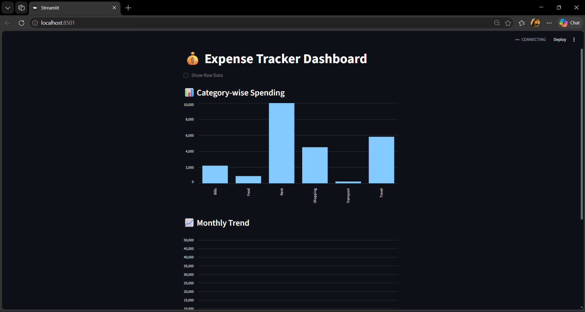
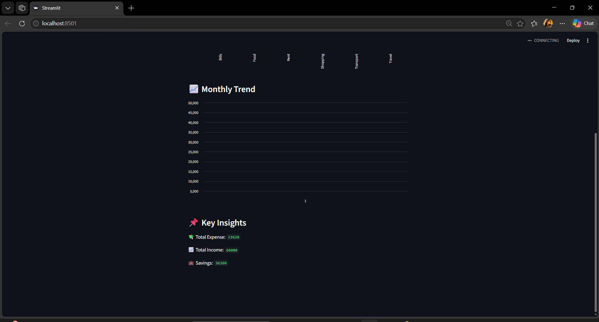

# 💰 Expense Tracker App

## 📌 Project Overview

The Expense Tracker App is a data-driven application designed to analyze and visualize personal expenses. It helps users track spending patterns, identify high-expense categories, and make better financial decisions.

---

## 🚀 Features

* 📊 Interactive dashboard for expense visualization
* 📈 Category-wise expense analysis
* 📅 Monthly spending trends
* 🧹 Data cleaning and preprocessing using Python
* 📌 Key insights generation

---

## 🛠️ Tech Stack

* Python 🐍
* Pandas
* Matplotlib / Seaborn
* Streamlit (for dashboard)

---

## 📂 Project Structure

```
Expense-Tracker-App/
│
├── data/
│   └── cleaned_expenses.csv
│
├── images/
│   └── dashboard.png
│
├── main.py
├── app.py
├── README.md
```

---

## 📸 Output Screenshots



---

## 📊 Key Insights

* Identified highest spending categories
* Monthly expense trends visualized
* Improved understanding of financial habits

---

## ▶️ How to Run

```bash
pip install -r requirements.txt
python main.py
streamlit run app.py
```

---

## 🌟 Future Improvements

* Add user authentication
* Real-time expense tracking
* Mobile-friendly UI

---

## 🙏 Acknowledgment

I would like to sincerely thank my mentor for providing this opportunity to work on real-world projects and helping me improve my skills and confidence.

---

## 🔗 GitHub Repository

https://github.com/saihema21/Expense-Tracker-App
